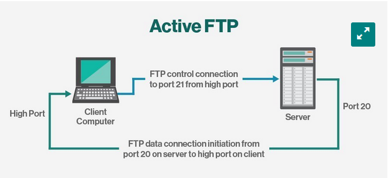

# FTP
FTP (File Transfer Protocol) is a network protocol for transmitting files between computers over Transmission Control Protocol/Internet Protocol (TCP/IP) connections. Within the TCP/IP suite, FTP is considered an application layer protocol.



## FTP types

There are several different ways an FTP server and client software can conduct a file transfer using FTP:

- **Anonymous FTP**. This is the most basic form of FTP. It provides support for data transfers without encrypting data or using a username and password. It's most commonly used for download of material that is allowed for unrestricted distribution. It works on port 21.
- **Password-protected FTP**. This is also a basic FTP service, but it requires the use of a username and password, though the service might not be encrypted or secure. It also works on port 21.
- **FTP Secure (FTPS)**. Sometimes referred to as FTP Secure Sockets Layer (FTP-SSL), this approach enables implicit Transport Layer Security (TLS) as soon as an FTP connection is established. FTPS was initially used to help enable a more secure form of FTP data transfer. It typically defaults to using port 990.
- **FTP over explicit SSL/TLS (FTPES)**. This approach enables explicit TLS support by upgrading an FTP connection over port 21 to an encrypted connection. This is a commonly used approach by web and file sharing services to enable secure file transfers.
- **Secure FTP (SFTP)**. This is technically not an FTP protocol, but it functions similarly. Rather, SFTP is a subset of the Secure Shell (SSH) protocol that runs over port 22. SSH is commonly used by systems administrators to remotely and securely access systems and applications, and SFTP provides a mechanism within SSH for secure file transfer.

## FTP security

FTP was initially defined in 1971, predating TCP and IP, and it has been redefined several times since then to accommodate new technologies, including the use of TCP/IP, or Request for Comments 765 and RFC 959, and IPv6, or RFC 2428.

FTP has also undergone several updates to enhance FTP security. These include versions that encrypt via an implicit TLS connection (FTPS) or explicit TLS connection (FTPES) or that work with SFTP.

By default, FTP does not encrypt traffic, and individuals can capture packets to read usernames, passwords and other data. By encrypting FTP with FTPS or FTPES, data is protected, limiting the ability of an attacker to eavesdrop on a connection and steal data.

FTP may still be vulnerable to brute-force attacks against user/password authentication spoofing, an FTP bounce attack or a distributed denial-of-service attack.
History of FTP

The first specification for FTP was published as RFC 114 on April 16, 1971, and was written by Abhay Bhushan, then a student at the Massachusetts Institute of Technology. The original idea behind FTP was to enable the transfer of files over ARPANET, the precursor to the internet.

As the modern internet began to take shape, the FTP specification underwent several revisions to align with networking standards, including TCP/IP. In 1980, a new version of FTP was defined in RFC 765 by Jon Postel, a research scientist at the Information Sciences Institute at the University of Southern California at the time. Five years later, FTP was redefined yet again with RFC 959, which introduced new management capabilities for the protocol, including the ability to make and remove a file directory. Prior iterations of FTP were largely limited to transferring files to and from existing file directory structures.

In 1997, RFC 959 was updated with new capabilities defined in RFC 2228 to provide security capabilities. Two years later, FTP was updated with RFC 2428 to support the IPv6 protocol.
FTP clients

## The FTP Command

Connecting:
```bash
ftp [IP]
```

Listing:
```bash
ls
```

Transferring files to the local computer:
```bash
get [file]
```

Transferring multiple files to the local computer:
```bash
mget [*.pdf]
```

Uploading files:
```bash
put [file]
```

Uploading multiple files:
```bash
mput [*.pdf]
```

Creating directories:
```bash
mkdir [name]
```

Changing directory:
```bash
cd [directory]
```

Current directory:
```bash
pwd
```

Renaming file:
```bash
rename [current file] [new file]
```

Deleting files:
```bash
delete [file]
mdelete [*.pdf]
```
